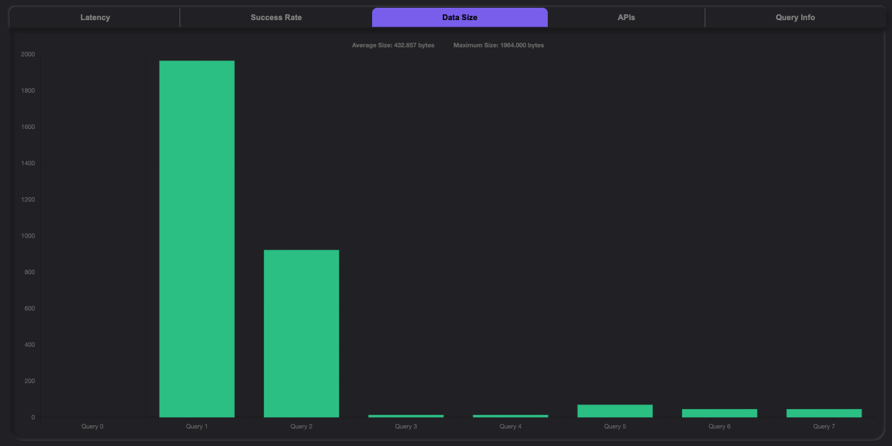
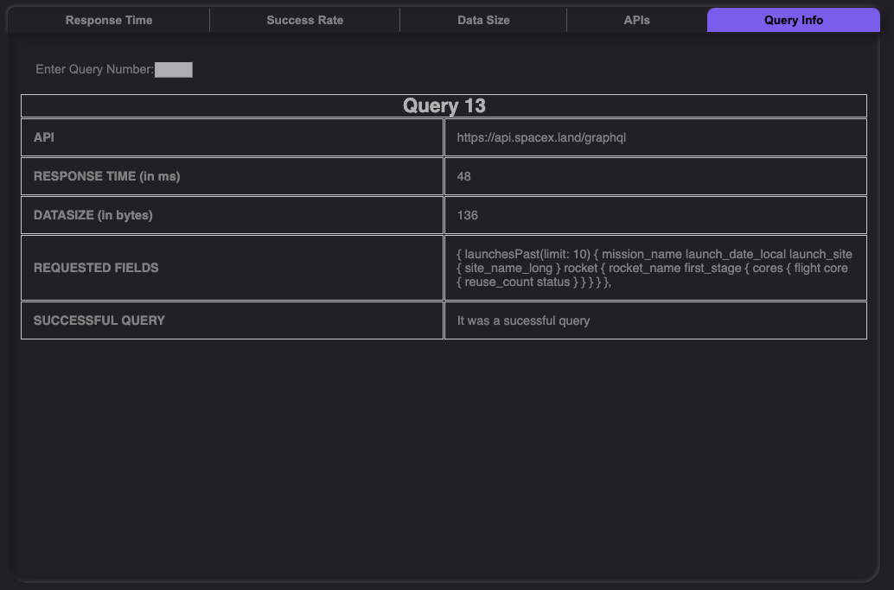

<h3 style="color:red"}> ** Artemis is currently undergoing a major re-write. If you notice any bugs please report an issue. We apologize for the inconvenience. ** </h3>

<div align="center">A Deno-built Analytics Tool for GraphQL Queries</div>

<div align="center">

<h1 align="center">
	<a>Artemis</a>
	    <div></div>
</h1>

<p align="center">from <em align="center">Our Team</em></p>

</div>

<p align="center">
  
  
  
  
  
</p>

You can use Artemis without installing by visiting our<a href src="https://project-artemis-v1.vercel.app"> online platform </a>.


## Features

Artemis provides analytics including aggregate response time, success and error instance ratios, returned data size, and persistent individual snapshots of each successful query results.

## Overview

Artemis is Deno's first native GraphQL query analytics tool with a graphical user interface to visualize performance metrics.

Our dynamic GUI, compiled using Aleph.js, allows users to send query requests to external APIs that use GraphQL. Under the hood, sophisticated and performant algorithms calculate performance metrics for each query request and Artemis immediately displays them as accessible and digestible analytics for developers.

## To Get Started

To install Aleph, enter the following command in your terminal.

```javascript
deno install -A -f -n aleph https://deno.land/x/aleph@v0.2.26/cli.ts
```

Remember to export to PATH.

To load the GUI on your localhost, enter the following command in your terminal.
```javascript
aleph dev
```

## Documentation and Demo

Simply enter the endpoint URL you are testing and select the number of times to run the query, then watch as Artemis visualized your results in real time. Here is a great <a href src="https://github.com/APIs-guru/graphql-apis"> resource</a> for external APIs that work with GraphQL.

You'll notice the graphs will render dynamically.

**Please note the functionality to run numerous queries is still being worked on. Use the default Number of queries(1).**

<div></div>

## Making a Query

Syntax is extremely important for the success of your query.

Please refer to the following <a href src="https://graphql.org/">documentation</a> if you are not familiar with GraphQL queries.

Here is an example of a query request to Space X's API.

```javascript
URL: https://api.spacex.land/graphql

Query:
{
  launchesPast(limit: 10) {
    mission_name
    launch_date_local
    launch_site {
      site_name_long
    }
    rocket {
      rocket_name
      first_stage {
        cores {
          flight
          core {
            reuse_count
            status
          }
        }
      }
  }
}
```
The following will be populated after:

<div>




</div>


## Authors

[Stella Liao](https://github.com/Stellaliao01)
[Erick Melendez](https://github.com/mlndz-la)
[Greg Dixon](https://github.com/greg-dixon)
[Taylor Morgan](https://github.com/TaylorMorgan7)
[Scott Burman](https://github.com/Scottburs)
